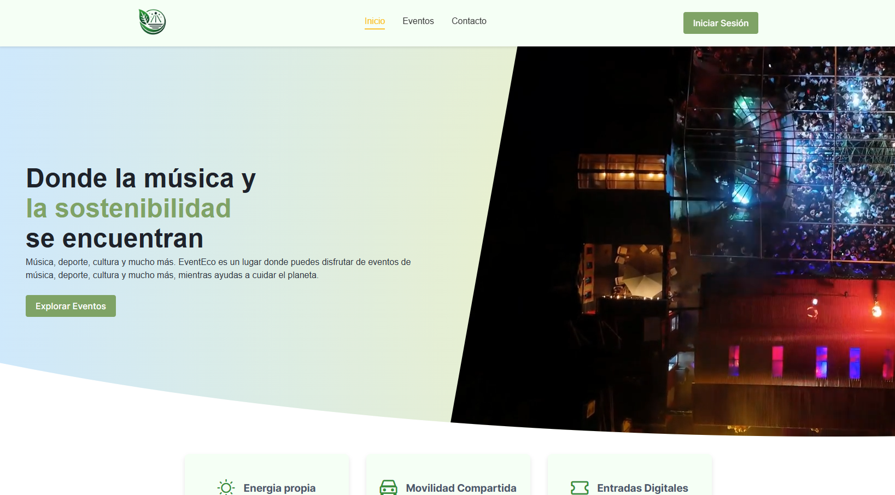
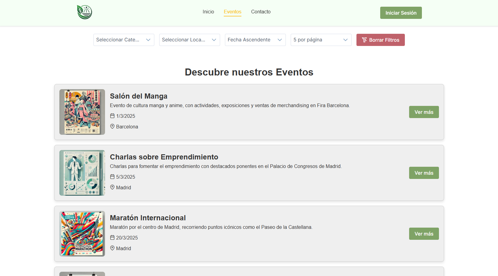
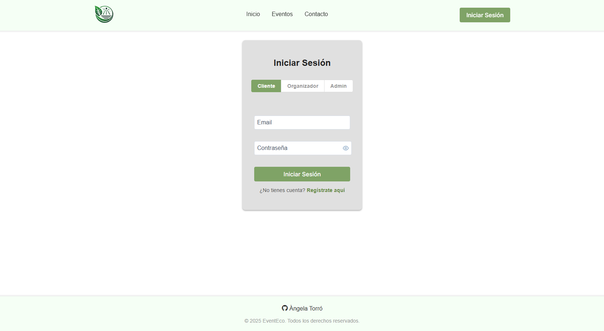
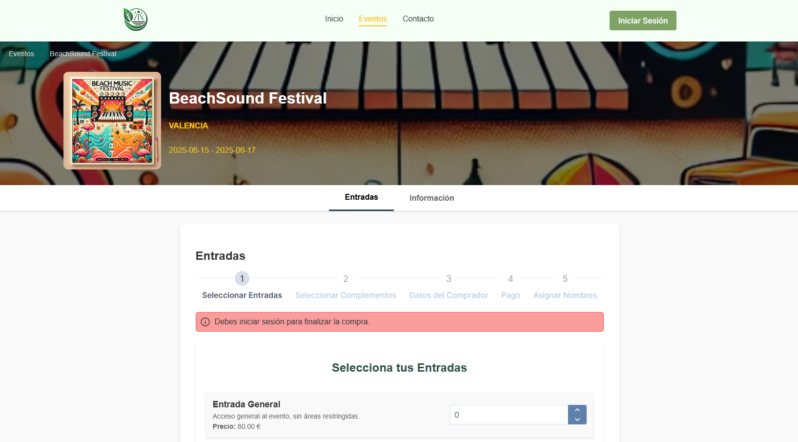
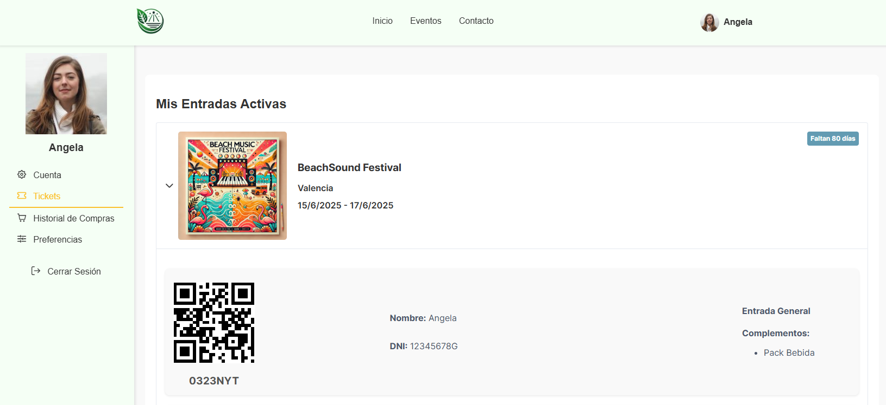
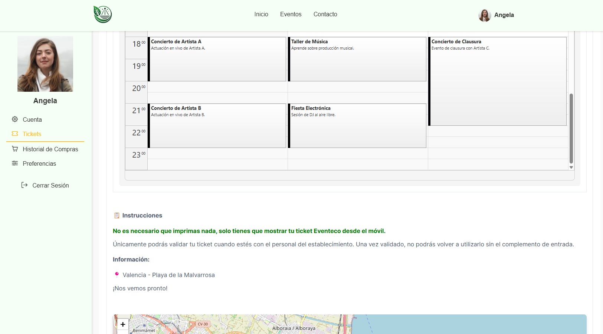
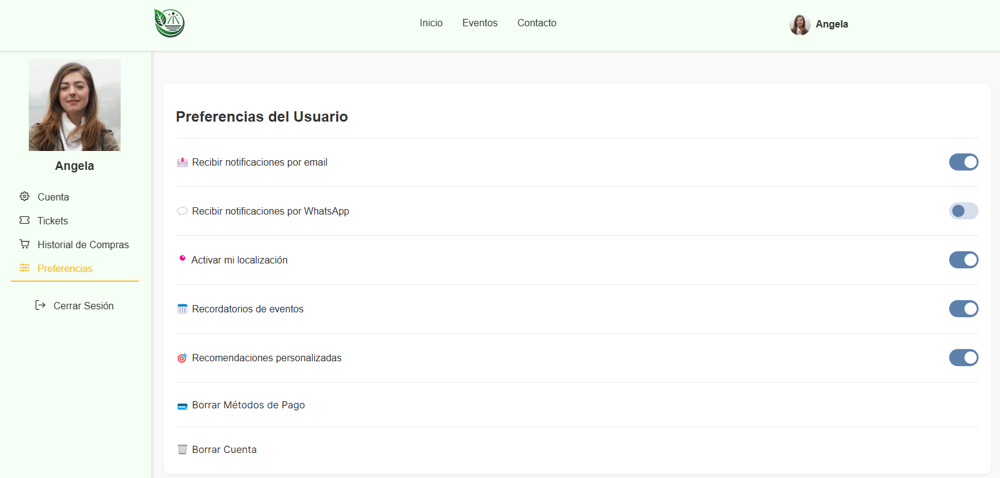
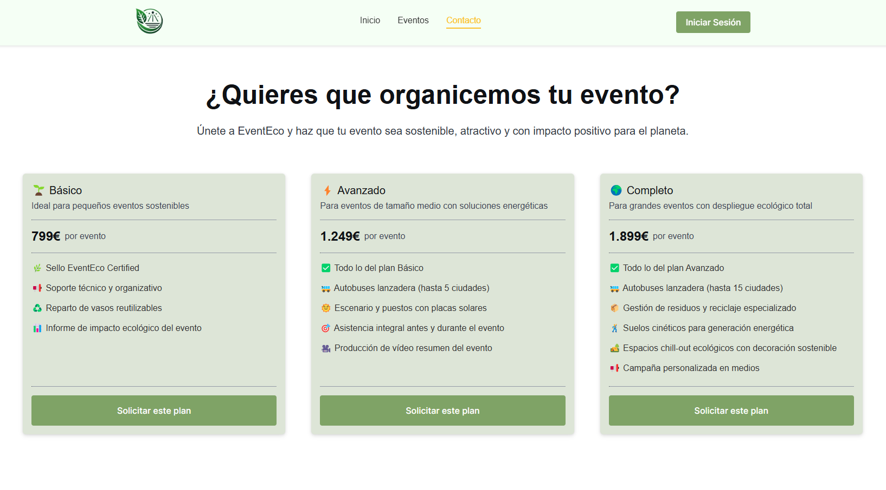
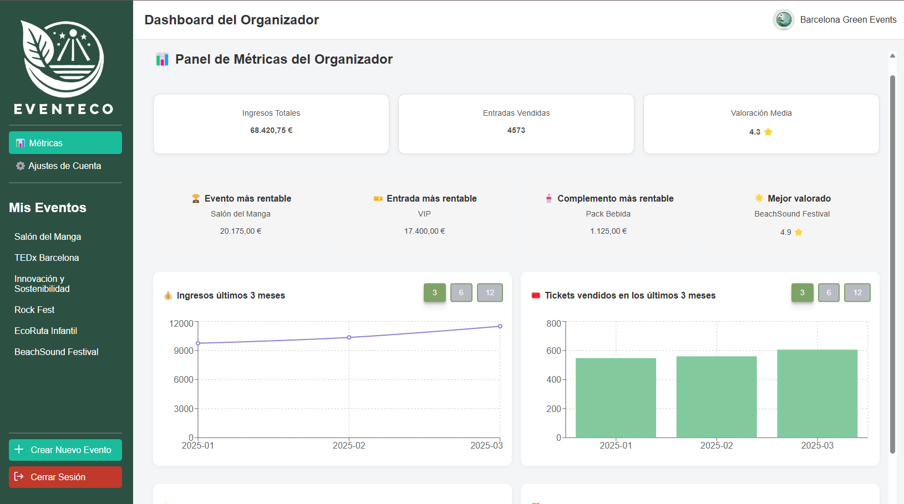
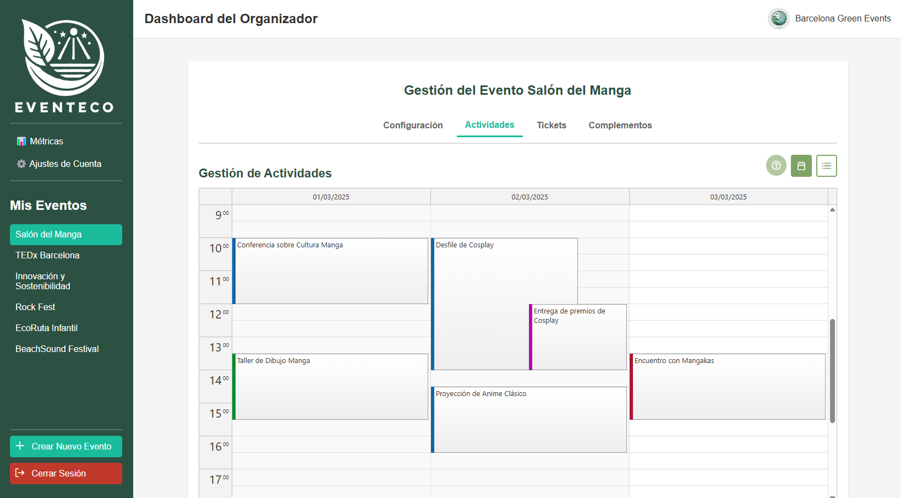

**EventEco** es una plataforma web enfocada en la **organización de eventos sostenibles**, donde se conectan empresas organizadoras, asistentes y la tecnología para promover prácticas eco-friendly en conciertos, festivales, conferencias y más.

---

## 🧩 Tecnologías Utilizadas

- **Frontend:** Next.js 14 + React 18
- **Estado:** React Query 5 - Redux
- **Backend:** Django (para clientes) y Symfony (para organizadores)
- **Base de Datos:** PostgreSQL
- **Estilos:** PrimeReact + CSS Modules
- **Autenticación:** JWT + Middleware de Next.js
- **Email:** Resend + React Email
- **Whatsapp:** Ultramessage
- **Pagos:** Stripe Checkout - SpringBoot
- **Diseño Responsive:** Mobile-first con componentes reutilizables
- **Otros:** Calendario interactivo, Toastr, lógica desacoplada mediante hooks y servicios

---

## 🛒 Marketplace y Home

- Home con video IA promocional
- Skeletons de carga con React Query
- Paginación dinámica en Shop con filtros
- Uso de caché para eventos y categorías
- Metadata para SEO por página

---

## 🔐 Login y Registro

- Registro unificado con selector de tipo de usuario: **Cliente**, **Organizador**, **Admin**
- Validaciones específicas por tipo de usuario
- Autenticación con JWT
- Middleware de protección de rutas según el rol
- Modal de login/registro embebido en el flujo de compra si no estás autenticado

---

## 🎟️ Proceso de Compra de Entradas

- **Stepper con 5 pasos**:
  1. Selección de tickets
  2. Selección de complementos por ticket
  3. Información del comprador
  4. Pago con Stripe
  5. Nominación de entradas

- Validaciones dinámicas
- Cálculo de precio total en tiempo real
- Notificaciones con Toastr
- Requiere login antes del pago

---

## 📱 Área de Cliente

### 🎫 Mis Entradas

- Visualización de pedidos agrupados por evento
- Entradas activas con código y QR con datos del asistente, complementos y resumen
- Calendario de actividades del evento (modo lectura)
- Mapa del evento integrado
- Instrucciones para validar la entrada
- Puntuación del evento tras asistir

### ⚙️ Preferencias

- Toggles de configuración:
  - Notificaciones por email
  - Notificaciones por WhatsApp
  - Recordatorios de eventos
  - Recomendaciones personalizadas
 

---

## 🧾 Contacto para Organizadores

- Diferentes planes a contratar
- Oferta de servicios sostenibles
- Formulario de envio
- Política de Privacidad
- Términos y Condiciones del contrato.

---

## 🧑‍💼 Dashboard para Organizadores

### 🎯 Estructura General

- Sidebar dividido en:
  - Parte superior: métricas y ajustes
  - Parte media: lista de eventos
  - Parte inferior: crear evento y logout
 

### 📝 Gestión de Eventos

Cada evento tiene una vista con tabs para gestionar:

- **Datos del Evento**: formulario de edición
- **Subeventos**: vista calendario + vista lista
- **Tickets**: CRUD con activación/desactivación
- **Complementos**: CRUD similar al de tickets

### 📅 Subeventos

- Vista calendario tipo Google Calendar (personalizado por los dias del evento)
- Drag & drop, resize, y edición en modal
- Calendario configurable por evento
- Solapamiento de actividades
- Vista lista alternativa con edición embebida

---

## ✉️ Sistema de Notificaciones

- Emails automáticos al finalizar la compra con:
  - Nombre de la empresa
  - Nombre del evento
  - Código de entradas
  - QR de entradas
  - Resumen del pedido
  - Footer legal

- Whatsapp automáticos al confirmar el pago con:
  - Confirmacion de pago
  - Aviso de nominación de entradas
  - Aviso de recepción de correo

---

## 💡 Propuesta de Valor Tecnológica

- 🔋 Organización de eventos eco-friendly con tecnología avanzada
- 🌍 Experiencia multiplataforma 100% digital
- 🚀 Plataforma responsive, accesible y optimizada
- 💬 Comunicación constante entre empresa y cliente
- 📊 Datos de impacto ambiental y trazabilidad del evento

---

## 📜 Licencia

Este proyecto está licenciado bajo la Licencia MIT.
